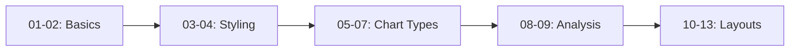

<div align="center">

# 📊 Matplotlib Visualization Mastery

### *A Complete Guide to Data Visualization with Python*

[](https://www.python.org/)
[](https://matplotlib.org/)
[](LICENSE)
[](https://github.com/AdityaSinghRajput/matplotlib-learning/pulls)

*Master the art of data visualization through 13 hands-on examples covering everything from basic plots to advanced multi-chart layouts.*

[Getting Started](#-quick-start) • [Examples](#-visualization-gallery) • [Documentation](#-learning-path) • [Contributing](#-contributing)

</div>

---

## 🎯 About This Project

This repository is a comprehensive learning resource for **Matplotlib**, Python's most powerful data visualization library. Whether you're a beginner taking your first steps in data science or looking to sharpen your plotting skills, this collection provides practical, ready-to-run examples.

## ✨ What's Inside

<table>
<tr>
<td width="50%">

### 📈 Line Plots
- Simple line charts
- Customized styling & markers
- Multi-line comparisons
- Grid & axis customization

</td>
<td width="50%">

### 📊 Bar Charts
- Vertical & horizontal bars
- Product comparison charts
- Color-coded categories
- Sales analytics

</td>
</tr>
<tr>
<td width="50%">

### 🥧 Pie Charts
- Percentage distributions
- Custom color schemes
- Legend positioning
- Real-world examples

</td>
<td width="50%">

### 📉 Statistical Plots
- Histograms with bins
- Scatter plots
- Correlation analysis
- Distribution visualization

</td>
</tr>
</table>

## 🚀 Quick Start

### Prerequisites

```bash
# Install Matplotlib
pip install matplotlib

# Or using conda
conda install matplotlib
```

### Run Your First Plot

```bash
# Clone the repository
git clone https://github.com/AdityaSinghRajput/matplotlib-learning.git
cd matplotlib-learning

# Run any example
python 01.py
```

## 📚 Visualization Gallery

### 🔰 Beginner Level

| File | Visualization Type | Key Concepts |
|------|-------------------|--------------|
| `01.py` | **Basic Line Plot** | Simple x,y plotting |
| `02.py` | **Labeled Line Chart** | Axis labels, grid, titles |
| `05.py` | **Horizontal Bar Chart** | Product sales comparison |
| `06.py` | **Pie Chart** | Percentage distribution, autopct |

### 🔶 Intermediate Level

| File | Visualization Type | Key Concepts |
|------|-------------------|--------------|
| `03.py` | **Styled Line Plot** | Colors, markers, linestyles, legends |
| `04.py` | **Exportable Plot** | Custom ticks, saving with DPI |
| `07.py` | **Histogram** | Bins, distribution analysis |
| `08.py` | **Scatter Plot** | Correlation visualization |

### 🔥 Advanced Level

| File | Visualization Type | Key Concepts |
|------|-------------------|--------------|
| `09.py` | **Multi-Series Scatter** | Multiple datasets, markers |
| `10.py` | **Subplots (Method 1)** | `plt.subplot()` layout |
| `11.py` | **Subplots (Method 2)** | `plt.subplots()` with axes |
| `12.py` | **Styled Subplots** | Custom colors per subplot |
| `13.py` | **Complete Dashboard** | Figure title, tight layout |

## 🎓 Learning Path



### Recommended Order

1. **Start Simple** → `01.py`, `02.py` - Understand basic plotting
2. **Add Style** → `03.py`, `04.py` - Learn customization
3. **Explore Types** → `05.py`, `06.py`, `07.py` - Different chart types
4. **Analyze Data** → `08.py`, `09.py` - Scatter plots & correlations
5. **Master Layouts** → `10.py` through `13.py` - Multiple plots

## �️ Key Features

<div align="center">

| Feature | Description |
|---------|-------------|
| 🎨 **Customization** | Colors, markers, line styles, and more |
| 📐 **Grid Systems** | Professional-looking grid layouts |
| 🏷️ **Labels & Legends** | Clear data identification |
| 💾 **Export Options** | Save plots as high-quality images |
| 📊 **Multiple Charts** | Subplots and dashboard layouts |
| 🎯 **Real Examples** | Practical use cases (sales, scores, etc.) |

</div>

## 📸 Sample Output

<div align="center">


*Example output from `04.py` - Customized line plot with grid and custom ticks*

</div>

## 💡 Code Snippets

### Quick Example: Styled Line Plot

```python
import matplotlib.pyplot as plt

months = [1, 2, 3, 4]
sales = [300, 400, 500, 800]

plt.plot(months, sales, color="green", linestyle='--', 
         linewidth=1, marker="o", label="Sales Data")

plt.xlabel("Months")
plt.ylabel("Sales per Month")
plt.title("Sales Chart")
plt.grid(color="gray", linestyle=":")
plt.legend()
plt.show()
```

### Quick Example: Subplots

```python
import matplotlib.pyplot as plt

fig, ax = plt.subplots(1, 2, figsize=(10, 5))

x = [1, 2, 3, 4]
y = [10, 20, 36, 43]

ax[0].plot(x, y, color="blue")
ax[0].set_title('Line Plot')

ax[1].bar(x, y, color="green")
ax[1].set_title("Bar Chart")

plt.tight_layout()
plt.show()
```

## 🤝 Contributing

Contributions are welcome! Here's how you can help:

1. 🍴 Fork the repository
2. 🌿 Create a feature branch (`git checkout -b feature/AmazingFeature`)
3. 💾 Commit your changes (`git commit -m 'Add some AmazingFeature'`)
4. 📤 Push to the branch (`git push origin feature/AmazingFeature`)
5. 🎉 Open a Pull Request

### Ideas for Contributions

- Add more visualization types (3D plots, heatmaps, etc.)
- Create interactive examples with widgets
- Add Jupyter notebook versions
- Improve documentation
- Add unit tests

## � Resources

- [Matplotlib Official Documentation](https://matplotlib.org/stable/contents.html)
- [Matplotlib Gallery](https://matplotlib.org/stable/gallery/index.html)
- [Python Data Science Handbook](https://jakevdp.github.io/PythonDataScienceHandbook/)

## 📄 License

This project is licensed under the MIT License - see the [LICENSE](LICENSE) file for details.

```
MIT License - Copyright (c) 2026 Aditya Singh Rajput
```

## 🌟 Show Your Support

If you found this helpful, please give it a ⭐️!

## � Contact

**Aditya Singh Rajput**

- GitHub: [@AdityaSinghRajput](https://github.com/AdityaSinghRajput)
- Project Link: [https://github.com/AdityaSinghRajput/matplotlib-learning](https://github.com/AdityaSinghRajput/matplotlib-learning)

---

<div align="center">

**Made with ❤️ for the Data Science Community**

*Happy Plotting!* 📈✨

</div>
